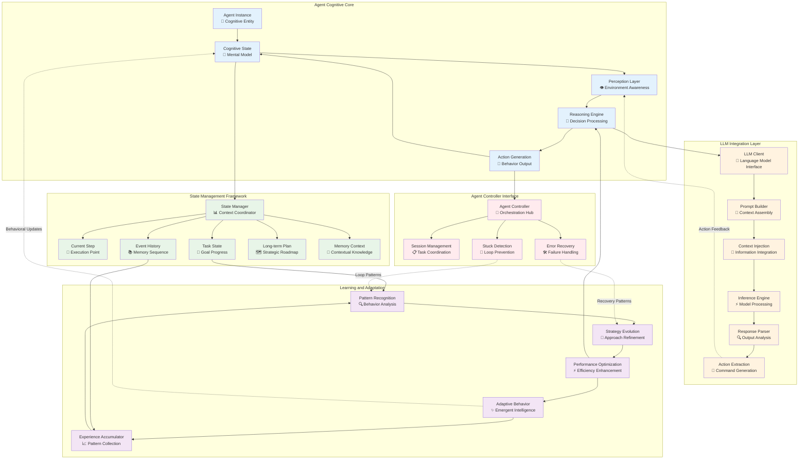
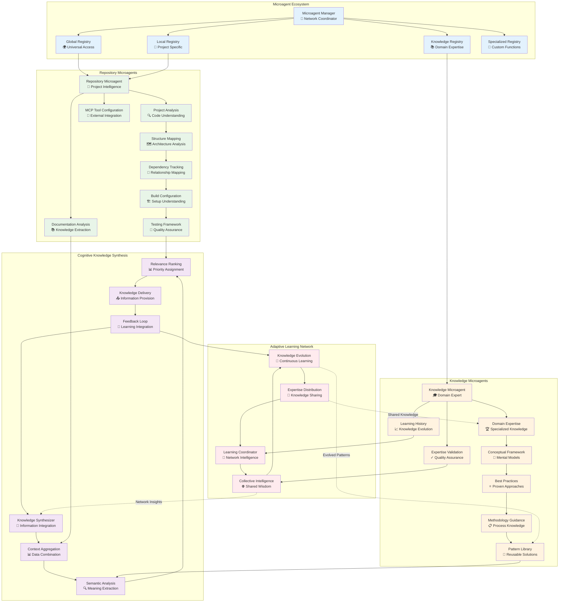
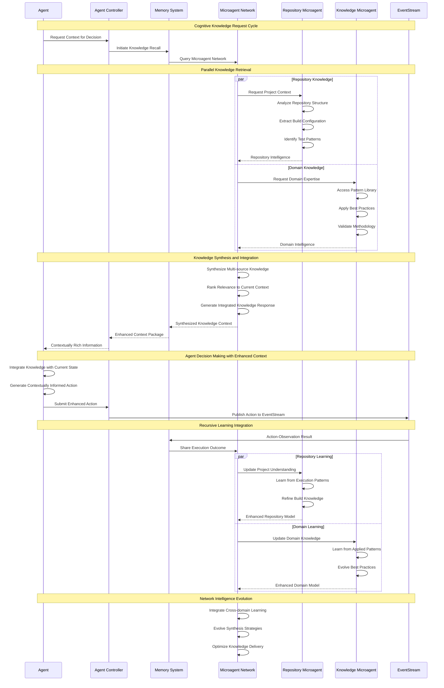
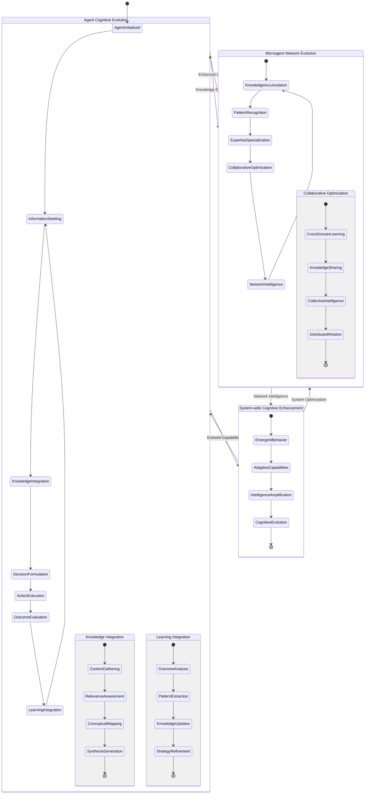
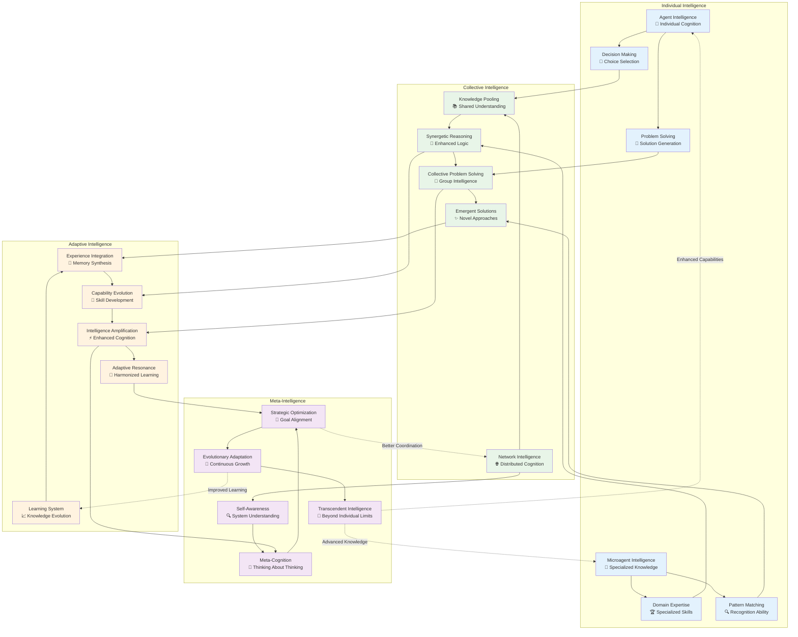

# Agent and Microagent Cognitive Architecture

This document details the cognitive architecture of OpenHands agents and the distributed microagent knowledge network, showcasing recursive learning patterns and emergent intelligence behaviors.

## Agent Cognitive Processing Architecture

The core agent represents the primary decision-making entity with recursive cognitive loops and adaptive behavior patterns:

## Microagent Knowledge Network Architecture

The microagent system creates a distributed knowledge network with specialized cognitive capabilities:

## Agent-Microagent Interaction Patterns

This diagram shows the recursive interaction patterns between agents and microagents:

## Cognitive State Evolution Architecture

This diagram illustrates how agent cognitive states evolve through recursive interaction with microagents:

## Emergent Intelligence Patterns

This diagram shows the emergent intelligence behaviors arising from agent-microagent interactions:

---

## Cognitive Architecture Implementation Notes

### Recursive Cognitive Loops
- Agent cognitive processes create recursive feedback loops where each decision informs future cognitive states
- Microagents continuously evolve their knowledge based on observed agent behaviors and outcomes
- The system exhibits emergent intelligence through the interaction of individual and collective cognitive processes

### Distributed Knowledge Architecture
- Knowledge is distributed across specialized microagents, preventing single points of failure
- Cross-domain learning enables knowledge transfer between different areas of expertise
- Collective intelligence emerges from the networked interaction of individual knowledge components

### Adaptive Learning Mechanisms
- The system continuously adapts based on performance feedback and environmental changes
- Learning occurs at multiple levels: individual agents, microagents, and the network as a whole
- Meta-cognitive capabilities enable the system to optimize its own learning processes

### Emergent Intelligence Behaviors
- Complex behaviors emerge from the interaction of simple cognitive rules
- The system exhibits self-organization and adaptive behavior patterns
- Intelligence amplification occurs through the synergistic combination of agent and microagent capabilities