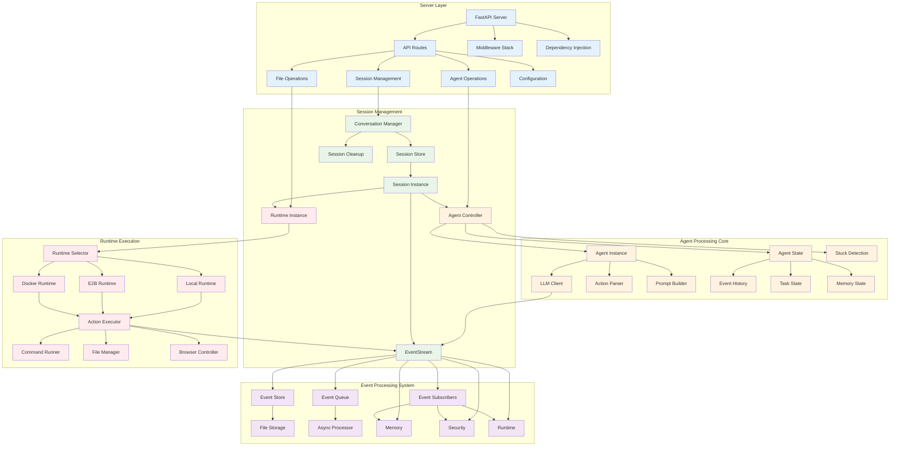

  
  
<em>OpenHands System Architecture Diagram (July 4, 2024)</em>

This is a high-level overview of the system architecture. The system is divided into two main components: the frontend and the backend. The frontend is responsible for handling user interactions and displaying the results. The backend is responsible for handling the business logic and executing the agents.

# Frontend architecture

This Overview is simplified to show the main components and their interactions. For a more detailed view of the backend architecture, see the Backend Architecture section below.

# Backend Architecture

_**Disclaimer**: The backend architecture is a work in progress and is subject to change. The following diagrams show the current architecture of the backend with comprehensive Mermaid visualizations._

## Backend Component Architecture

This diagram shows the detailed backend component structure and their interactions:

## Backend Data Flow Architecture

This diagram illustrates the data flow patterns and processing pipelines:

```mermaid
flowchart TD
    subgraph "Request Processing Flow"
        direction TB
        ClientRequest[Client Request] --> RequestValidation[Request Validation]
        RequestValidation --> Authentication[Authentication]
        Authentication --> SessionLookup[Session Lookup]
        SessionLookup --> RequestRouting[Request Routing]
    end
    
    subgraph "Agent Processing Pipeline"
        direction TB
        TaskReceived[Task Received] --> StateAnalysis[State Analysis]
        StateAnalysis --> ContextRetrieval[Context Retrieval]
        ContextRetrieval --> PromptGeneration[Prompt Generation]
        PromptGeneration --> LLMInference[LLM Inference]
        LLMInference --> ResponseParsing[Response Parsing]
        ResponseParsing --> ActionGeneration[Action Generation]
    end
    
    subgraph "Execution Pipeline"
        direction TB
        ActionValidation[Action Validation] --> SecurityCheck[Security Check]
        SecurityCheck --> RuntimeDispatch[Runtime Dispatch]
        RuntimeDispatch --> CommandExecution[Command Execution]
        CommandExecution --> ResultCapture[Result Capture]
        ResultCapture --> ObservationCreation[Observation Creation]
    end
    
    subgraph "Event Distribution Flow"
        direction TB
        EventCreation[Event Creation] --> EventSerialization[Event Serialization]
        EventSerialization --> EventQueuing[Event Queuing]
        EventQueuing --> SubscriberNotification[Subscriber Notification]
        SubscriberNotification --> EventPersistence[Event Persistence]
    end
    
    subgraph "Response Flow"
        direction TB
        ResponseAggregation[Response Aggregation] --> ResponseFormatting[Response Formatting]
        ResponseFormatting --> ClientDelivery[Client Delivery]
        ClientDelivery --> SessionUpdate[Session Update]
    end
    
    %% Flow connections
    RequestRouting --> TaskReceived
    ActionGeneration --> ActionValidation
    ObservationCreation --> EventCreation
    EventPersistence --> ResponseAggregation
    
    %% Feedback loops
    SessionUpdate -.-> StateAnalysis
    ResultCapture -.-> ContextRetrieval
    
    classDef request fill:#e3f2fd
    classDef agent fill:#e8f5e8
    classDef execution fill:#fff3e0
    classDef event fill:#f3e5f5
    classDef response fill:#ffebee
    
    class ClientRequest,RequestValidation,Authentication,SessionLookup,RequestRouting request
    class TaskReceived,StateAnalysis,ContextRetrieval,PromptGeneration,LLMInference,ResponseParsing,ActionGeneration agent
    class ActionValidation,SecurityCheck,RuntimeDispatch,CommandExecution,ResultCapture,ObservationCreation execution
    class EventCreation,EventSerialization,EventQueuing,SubscriberNotification,EventPersistence event
    class ResponseAggregation,ResponseFormatting,ClientDelivery,SessionUpdate response
```

## Legacy Architecture Reference

For comparison with the legacy PlantUML diagrams, the original backend architecture diagram is available at:

  
Updating this Diagram

  

    The generation of the backend architecture diagram is partially automated.
    The diagram is generated from the type hints in the code using the py2puml
    tool. The diagram is then manually reviewed, adjusted and exported to PNG
    and SVG.

    ## Prerequisites

    - Running python environment in which openhands is executable
    (according to the instructions in the README.md file in the root of the repository)
    - [py2puml](https://github.com/lucsorel/py2puml) installed

## Steps

1.  Autogenerate the diagram by running the following command from the root of the repository:
    `py2puml openhands openhands > docs/architecture/backend_architecture.puml`

2.  Open the generated file in a PlantUML editor, e.g. Visual Studio Code with the PlantUML extension or [PlantText](https://www.planttext.com/)

3.  Review the generated PUML and make all necessary adjustments to the diagram (add missing parts, fix mistakes, improve positioning).
    _py2puml creates the diagram based on the type hints in the code, so missing or incorrect type hints may result in an incomplete or incorrect diagram._

4.  Review the diff between the new and the previous diagram and manually check if the changes are correct.
    _Make sure not to remove parts that were manually added to the diagram in the past and are still relevant._

5.  Add the commit hash of the commit that was used to generate the diagram to the diagram footer.

6.  Export the diagram as PNG and SVG files and replace the existing diagrams in the `docs/architecture` directory. This can be done with (e.g. [PlantText](https://www.planttext.com/))

  

