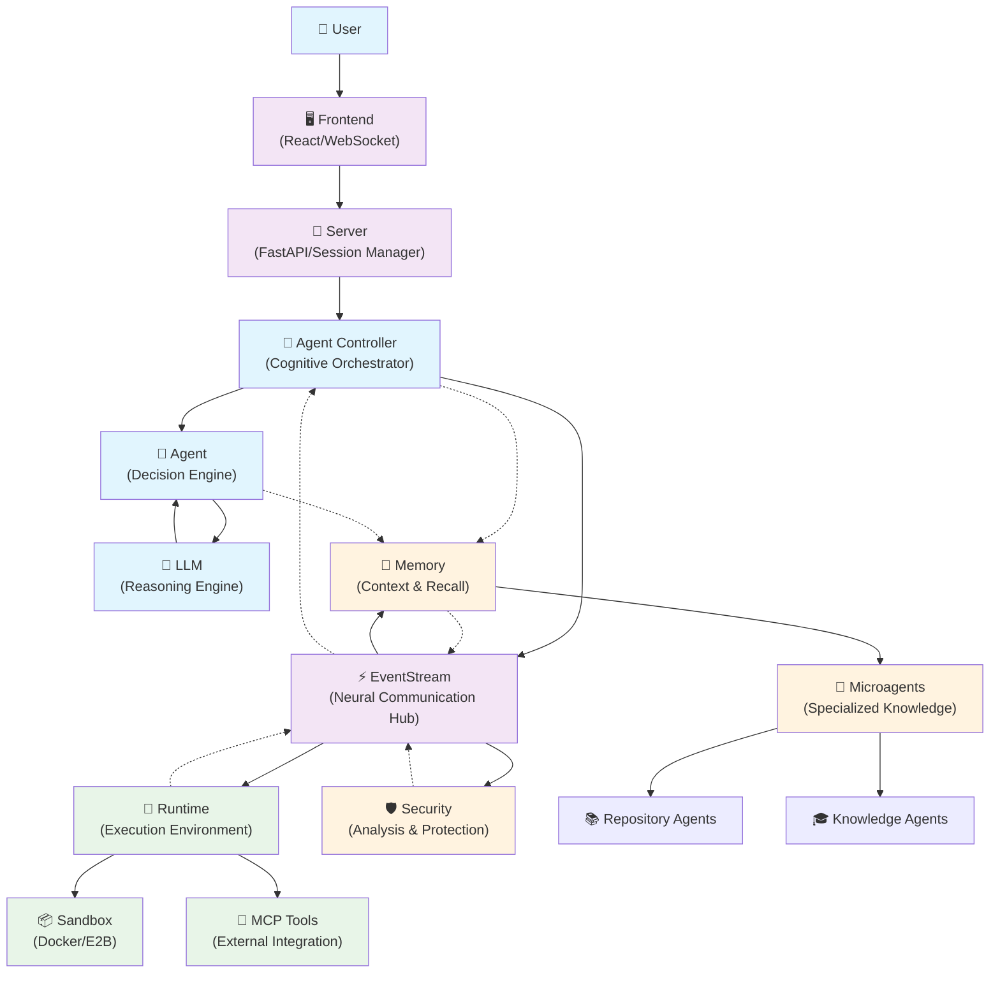
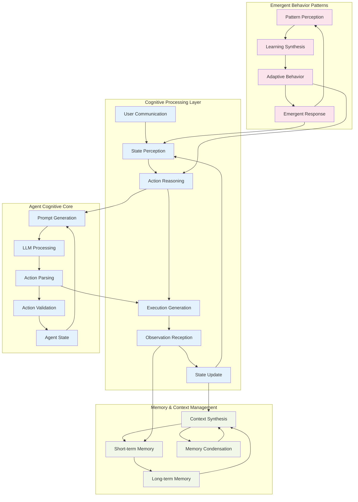
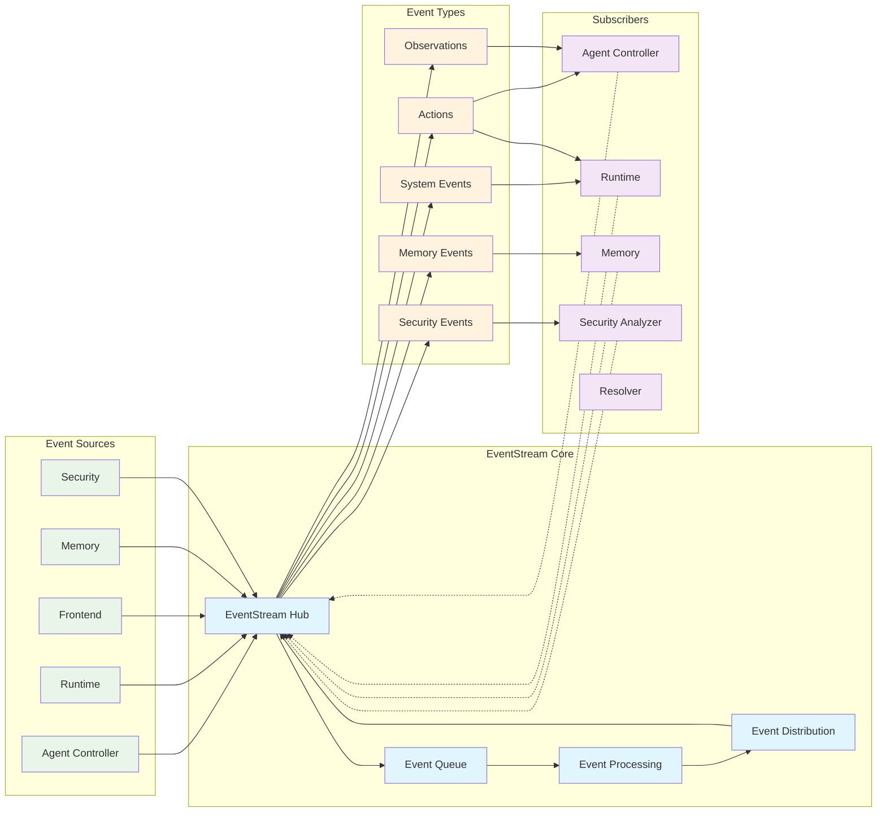
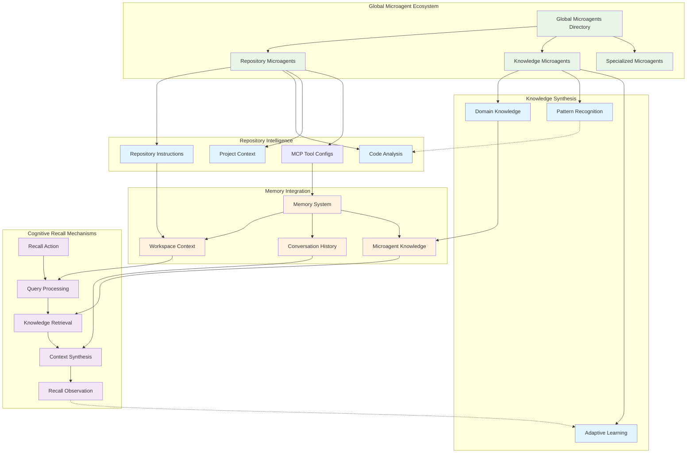
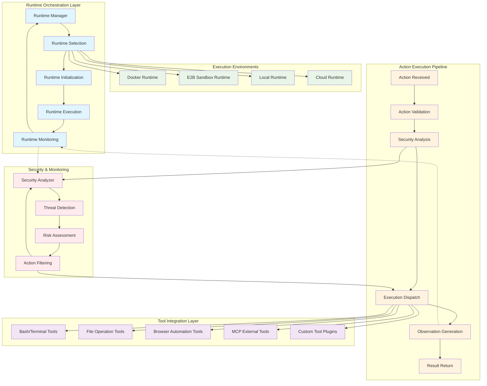
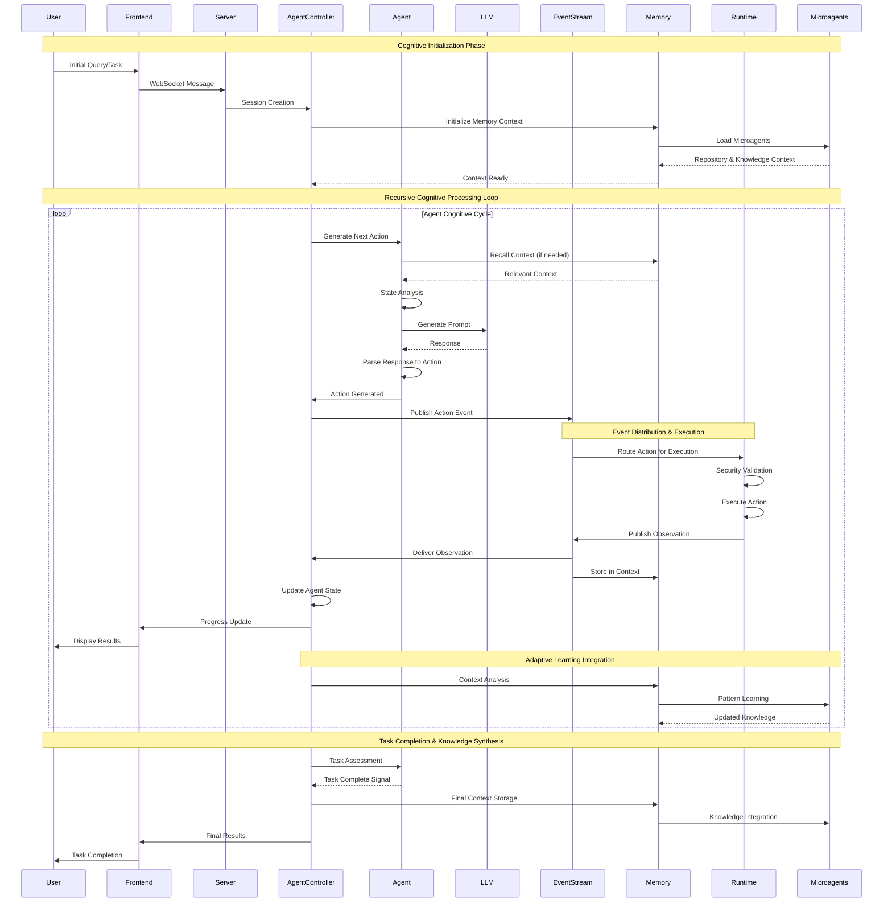
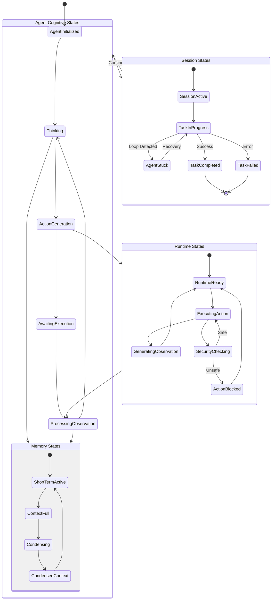
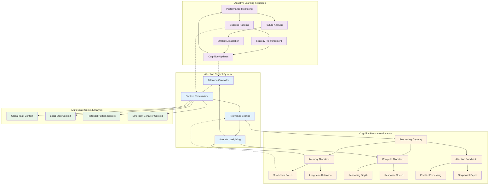

# OpenHands Comprehensive Architecture Documentation

This document provides a comprehensive view of OpenHands architecture through multiple Mermaid diagrams that illustrate the cognitive flowcharts, recursive system patterns, and emergent architectural components.

## High-Level System Overview

The OpenHands system represents a distributed cognitive architecture with recursive pattern encoding and neural-symbolic integration points. The system enables emergent agent behavior through hypergraph-centric communication patterns.

## Cognitive Control Flow Architecture

This diagram illustrates the recursive cognitive loops and emergent decision-making patterns within OpenHands:

## Event-Driven Neural Communication Architecture

The EventStream serves as the neural backbone enabling distributed cognition across all system components:

## Microagent Knowledge Network

This diagram shows the distributed knowledge architecture and cognitive synergy patterns:

## Runtime Execution Architecture

This diagram illustrates the multi-layered runtime environment with adaptive execution patterns:

## Sequence Diagram: Complete Agent Interaction Flow

This sequence diagram shows the temporal flow of cognitive processing and recursive interaction patterns:

## State Management & Memory Architecture

This diagram shows the recursive state management and memory condensation patterns:

## Adaptive Attention Allocation Mechanisms

This diagram illustrates the cognitive synergy optimizations and emergent attention patterns:

---

## Architecture Annotations

### Recursive Implementation Pathways

1. **Event-Driven Recursion**: The EventStream creates recursive communication patterns where events trigger actions that generate observations, which in turn trigger new events, creating emergent behavioral loops.

2. **Cognitive Feedback Loops**: The Agent-LLM-State cycle represents a recursive cognitive process where each iteration refines understanding and action generation based on accumulated context.

3. **Memory Condensation Recursion**: The memory system employs recursive summarization where historical events are progressively condensed while maintaining essential context for future decision-making.

4. **Adaptive Learning Recursion**: Microagents continuously update their knowledge based on interaction patterns, creating recursive improvement in system capabilities.

### Transcendent Technical Precision

- **Hypergraph Pattern Encoding**: Component relationships form a hypergraph where each node (component) can have multiple simultaneous connections to other nodes, enabling complex emergent behaviors.

- **Neural-Symbolic Integration**: The system bridges symbolic reasoning (code execution, logical operations) with neural processing (LLM inference), creating hybrid cognitive capabilities.

- **Emergent Cognitive Patterns**: The architecture enables emergent behaviors through the interaction of simple components following local rules, resulting in complex global behaviors.

- **Distributed Cognition**: Knowledge and processing are distributed across multiple components (agents, microagents, memory systems) that collaborate to achieve cognitive goals.

### Cognitive Synergy Optimizations

- **Attention Allocation**: Dynamic prioritization of cognitive resources based on task relevance and contextual importance.

- **Context Synthesis**: Intelligent merging of multiple information sources to create coherent understanding.

- **Adaptive Behavior**: System components modify their behavior based on performance feedback and environmental changes.

- **Knowledge Integration**: Seamless integration of repository-specific knowledge with general domain knowledge through microagent networks.