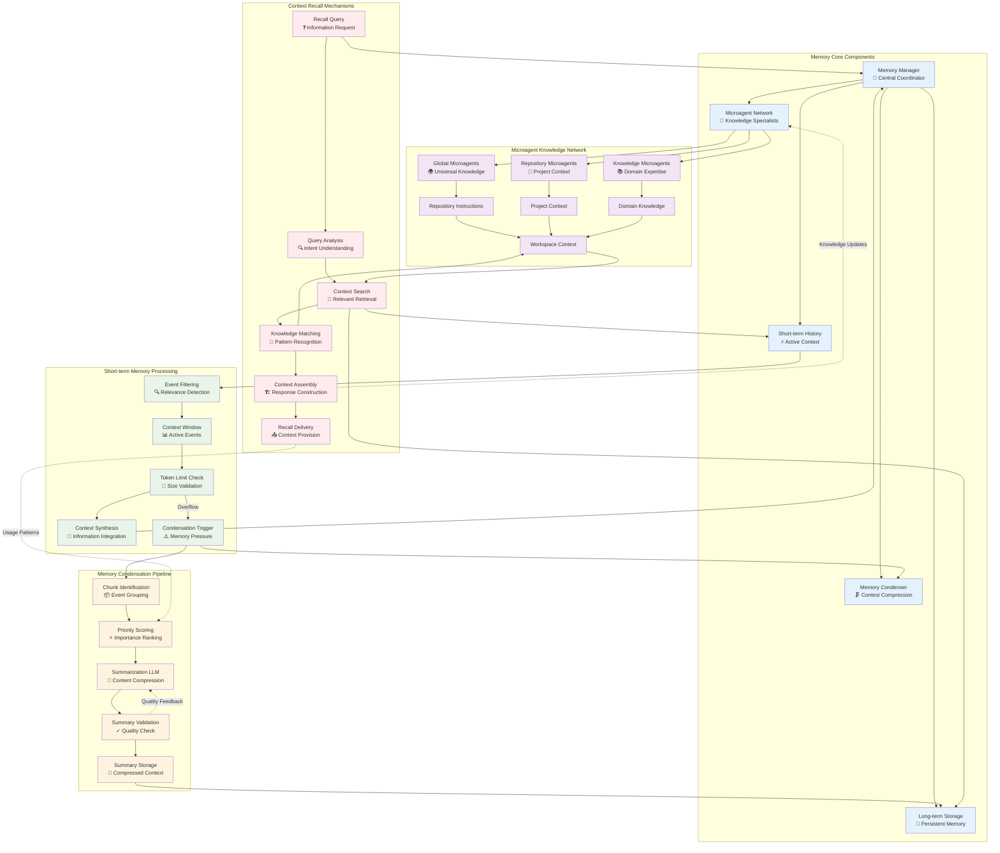
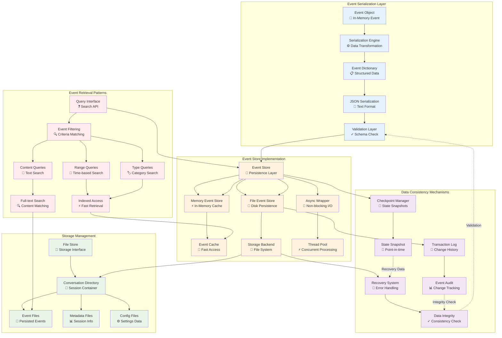
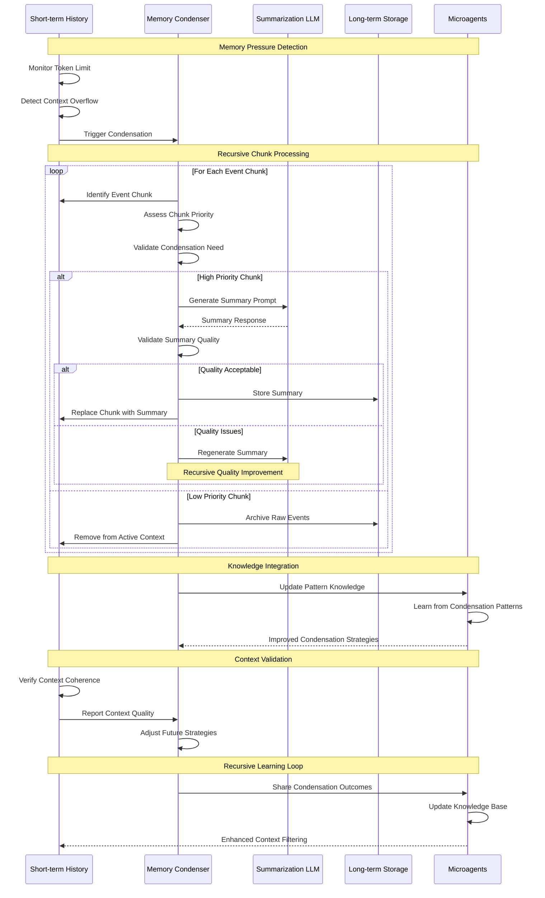
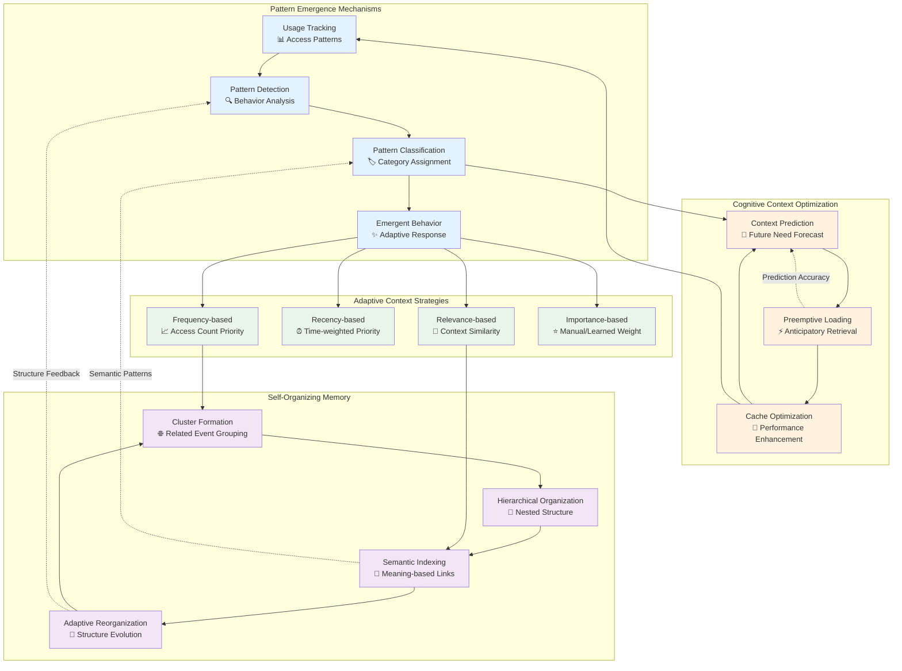

# Event System and Memory Architecture

This document provides detailed architectural views of OpenHands' event-driven communication system and adaptive memory mechanisms, showcasing the recursive and emergent patterns that enable distributed cognition.

## EventStream Neural Communication Hub

The EventStream represents the central nervous system of OpenHands, enabling distributed cognitive processing through recursive event patterns:

```mermaid
graph TB
    subgraph "Event Source Layer"
        direction TB
        AgentController[Agent Controller<br/>🧠 Cognitive Commands]
        Runtime[Runtime Systems<br/>🔧 Execution Results]
        Frontend[Frontend Interface<br/>🖥️ User Interactions]
        Memory[Memory System<br/>🧮 Context Requests]
        Security[Security Analyzer<br/>🛡️ Threat Events]
        Resolver[Resolver Service<br/>🔍 Analysis Events]
    end
    
    subgraph "EventStream Core Processing"
        direction TB
        EventReceiver[Event Receiver<br/>📥 Input Processing]
        EventReceiver --> EventQueue[Event Queue<br/>⚡ Async Buffer]
        EventQueue --> EventProcessor[Event Processor<br/>⚙️ Message Routing]
        EventProcessor --> EventDistributor[Event Distributor<br/>📤 Subscriber Delivery]
        
        EventDistributor --> EventPersistence[Event Persistence<br/>💾 Storage Layer]
        EventPersistence --> FileStore[File Store<br/>📁 Conversation Data]
    end
    
    subgraph "Event Type Classification"
        direction LR
        Actions[Actions<br/>🎯 Intent Commands]
        Observations[Observations<br/>👁️ Environment Feedback]
        SystemEvents[System Events<br/>⚙️ Infrastructure Messages]
        MemoryEvents[Memory Events<br/>🧠 Context Operations]
        SecurityEvents[Security Events<br/>🚨 Threat Notifications]
    end
    
    subgraph "Subscriber Network"
        direction TB
        AgentSubscriber[Agent Controller<br/>🎯 Action Processing]
        RuntimeSubscriber[Runtime<br/>⚡ Execution Handling]
        MemorySubscriber[Memory<br/>💭 Context Management]
        SecuritySubscriber[Security<br/>🔒 Threat Analysis]
        ResolverSubscriber[Resolver<br/>🔍 Code Analysis]
        ServerSubscriber[Server<br/>🌐 Client Communication]
    end
    
    %% Event flow from sources
    AgentController --> EventReceiver
    Runtime --> EventReceiver
    Frontend --> EventReceiver
    Memory --> EventReceiver
    Security --> EventReceiver
    Resolver --> EventReceiver
    
    %% Event type routing
    EventProcessor --> Actions
    EventProcessor --> Observations
    EventProcessor --> SystemEvents
    EventProcessor --> MemoryEvents
    EventProcessor --> SecurityEvents
    
    %% Subscriber delivery
    Actions --> AgentSubscriber
    Actions --> RuntimeSubscriber
    Observations --> AgentSubscriber
    Observations --> MemorySubscriber
    SystemEvents --> RuntimeSubscriber
    SystemEvents --> ServerSubscriber
    MemoryEvents --> MemorySubscriber
    SecurityEvents --> SecuritySubscriber
    
    %% Recursive feedback patterns
    AgentSubscriber -.->|New Actions| EventReceiver
    RuntimeSubscriber -.->|Observations| EventReceiver
    MemorySubscriber -.->|Context Updates| EventReceiver
    SecuritySubscriber -.->|Security Reports| EventReceiver
    
    classDef source fill:#e3f2fd
    classDef core fill:#e8f5e8
    classDef types fill:#fff3e0
    classDef subscribers fill:#f3e5f5
    
    class AgentController,Runtime,Frontend,Memory,Security,Resolver source
    class EventReceiver,EventQueue,EventProcessor,EventDistributor,EventPersistence,FileStore core
    class Actions,Observations,SystemEvents,MemoryEvents,SecurityEvents types
    class AgentSubscriber,RuntimeSubscriber,MemorySubscriber,SecuritySubscriber,ResolverSubscriber,ServerSubscriber subscribers
```

## Memory System Cognitive Architecture

The memory system implements adaptive context management with recursive pattern learning:

## Event Serialization and Storage Architecture

This diagram shows the persistent storage patterns and data consistency mechanisms:

## Memory Condensation Recursive Algorithms

This sequence diagram shows the recursive memory condensation process:

## Emergent Memory Patterns

This diagram illustrates emergent behavioral patterns in the memory system:

---

## Technical Implementation Notes

### Recursive Event Processing
- Events trigger cascading actions through the EventStream, creating recursive behavioral loops
- Each event can spawn multiple child events, forming tree-like execution patterns
- Feedback loops ensure system-wide consistency and adaptive behavior

### Memory Condensation Algorithms
- Recursive summarization maintains context while reducing memory pressure
- Hierarchical compression preserves important details at multiple granularity levels
- Quality validation ensures summary fidelity through recursive improvement

### Emergent Pattern Recognition
- Usage patterns emerge from the interaction of individual access behaviors
- The system self-organizes based on discovered access patterns
- Adaptive strategies evolve based on performance feedback

### Distributed Cognitive Processing
- Memory components collaborate to maintain coherent system-wide context
- Microagents provide specialized knowledge that enhances memory retrieval
- Cross-component learning improves overall system intelligence over time