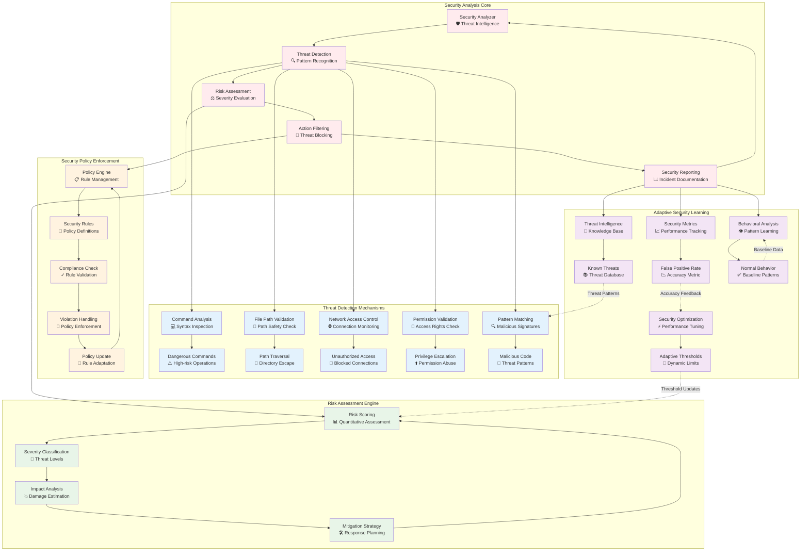
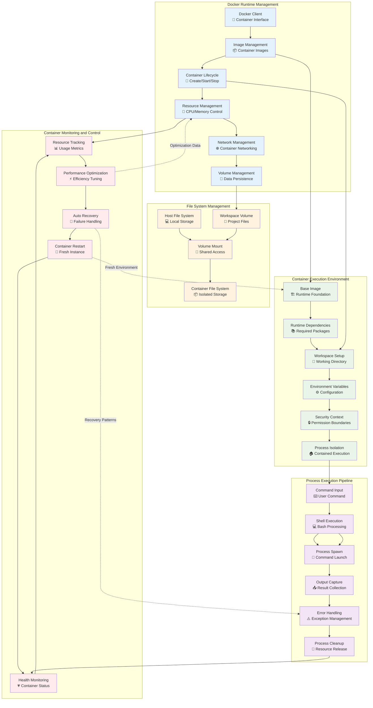
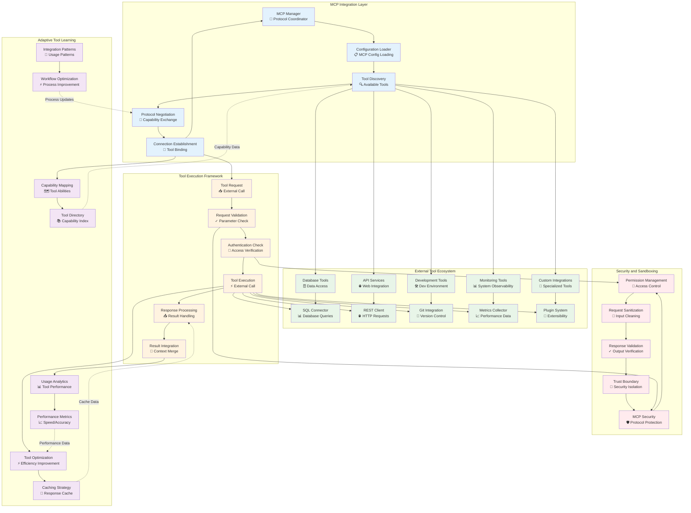
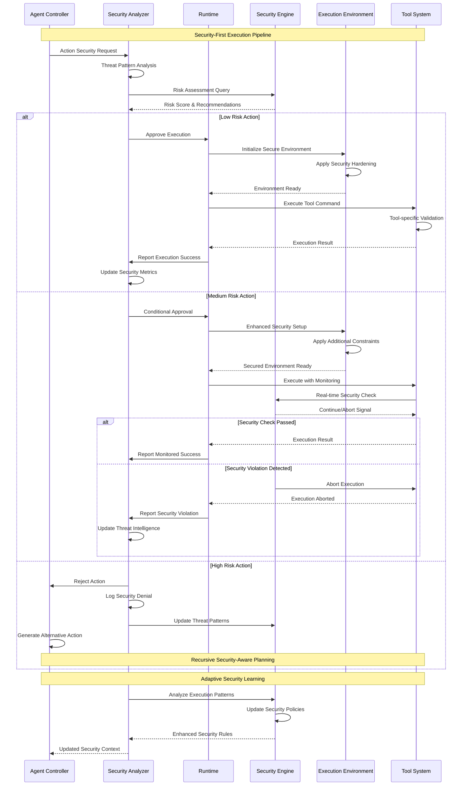

# Runtime and Security Architecture

This document details the runtime execution environment and security architecture of OpenHands, showcasing the adaptive execution patterns and recursive security validation mechanisms.

## Multi-Runtime Execution Architecture

The runtime system provides adaptive execution environments with recursive pattern validation:

```mermaid
graph TB
    subgraph "Runtime Orchestration Layer"
        direction TB
        RuntimeManager[Runtime Manager<br/>🎯 Execution Coordinator]
        RuntimeManager --> RuntimeFactory[Runtime Factory<br/>🏭 Instance Creation]
        RuntimeFactory --> RuntimeSelector[Runtime Selector<br/>🔍 Environment Choice]
        RuntimeSelector --> RuntimeInitializer[Runtime Initializer<br/>🚀 Setup Process]
        RuntimeInitializer --> RuntimeMonitor[Runtime Monitor<br/>📊 Health Tracking]
        RuntimeMonitor --> RuntimeManager
    end
    
    subgraph "Runtime Environment Types"
        direction LR
        DockerRuntime[Docker Runtime<br/>🐳 Containerized Execution]
        E2BRuntime[E2B Sandbox<br/>☁️ Cloud Execution]
        LocalRuntime[Local Runtime<br/>💻 Direct Execution]
        RemoteRuntime[Remote Runtime<br/>🌐 Distributed Execution]
        
        DockerRuntime --> DockerContainer[Docker Container<br/>📦 Isolated Environment]
        E2BRuntime --> E2BSandbox[E2B Sandbox<br/>🔒 Secure Cloud VM]
        LocalRuntime --> LocalProcess[Local Process<br/>⚡ Direct OS Access]
        RemoteRuntime --> RemoteHost[Remote Host<br/>🔗 Network Connection]
    end
    
    subgraph "Action Execution Pipeline"
        direction TB
        ActionReceived[Action Received<br/>📥 Command Input]
        ActionReceived --> ActionValidation[Action Validation<br/>✓ Syntax Check]
        ActionValidation --> SecurityAnalysis[Security Analysis<br/>🛡️ Threat Assessment]
        SecurityAnalysis --> ExecutionPrep[Execution Preparation<br/>⚙️ Environment Setup]
        ExecutionPrep --> CommandExecution[Command Execution<br/>⚡ Runtime Dispatch]
        CommandExecution --> ResultCapture[Result Capture<br/>📤 Output Collection]
        ResultCapture --> ObservationGeneration[Observation Generation<br/>📊 Response Creation]
    end
    
    subgraph "Execution Environment Management"
        direction TB
        EnvironmentSetup[Environment Setup<br/>🏗️ Runtime Preparation]
        EnvironmentSetup --> DependencyManagement[Dependency Management<br/>📦 Package Handling]
        DependencyManagement --> ResourceAllocation[Resource Allocation<br/>💾 Memory/CPU Assignment]
        ResourceAllocation --> NetworkConfiguration[Network Configuration<br/>🌐 Connectivity Setup]
        NetworkConfiguration --> SecurityHardening[Security Hardening<br/>🔒 Protection Measures]
        SecurityHardening --> EnvironmentValidation[Environment Validation<br/>✓ Readiness Check]
    end
    
    subgraph "Tool Integration Framework"
        direction LR
        ToolRegistry[Tool Registry<br/>📋 Available Tools]
        ToolRegistry --> BashTools[Bash Tools<br/>💻 Terminal Commands]
        ToolRegistry --> FileTools[File Tools<br/>📁 File Operations]
        ToolRegistry --> BrowserTools[Browser Tools<br/>🌐 Web Automation]
        ToolRegistry --> MCPTools[MCP Tools<br/>🔌 External Integration]
        ToolRegistry --> CustomTools[Custom Tools<br/>🛠️ Plugin System]
    end
    
    %% Runtime selection flow
    RuntimeSelector --> DockerRuntime
    RuntimeSelector --> E2BRuntime
    RuntimeSelector --> LocalRuntime
    RuntimeSelector --> RemoteRuntime
    
    %% Execution pipeline flow
    ActionReceived --> ActionValidation
    SecurityAnalysis --> ExecutionPrep
    ExecutionPrep --> EnvironmentSetup
    CommandExecution --> ToolRegistry
    
    %% Tool execution
    BashTools --> CommandExecution
    FileTools --> CommandExecution
    BrowserTools --> CommandExecution
    MCPTools --> CommandExecution
    CustomTools --> CommandExecution
    
    %% Monitoring feedback
    ResultCapture --> RuntimeMonitor
    EnvironmentValidation --> RuntimeMonitor
    
    %% Recursive improvement
    RuntimeMonitor -.->|Performance Data| RuntimeSelector
    ObservationGeneration -.->|Execution Patterns| SecurityAnalysis
    
    classDef orchestration fill:#e3f2fd
    classDef environment fill:#e8f5e8
    classDef pipeline fill:#fff3e0
    classDef management fill:#f3e5f5
    classDef tools fill:#ffebee
    
    class RuntimeManager,RuntimeFactory,RuntimeSelector,RuntimeInitializer,RuntimeMonitor orchestration
    class DockerRuntime,E2BRuntime,LocalRuntime,RemoteRuntime,DockerContainer,E2BSandbox,LocalProcess,RemoteHost environment
    class ActionReceived,ActionValidation,SecurityAnalysis,ExecutionPrep,CommandExecution,ResultCapture,ObservationGeneration pipeline
    class EnvironmentSetup,DependencyManagement,ResourceAllocation,NetworkConfiguration,SecurityHardening,EnvironmentValidation management
    class ToolRegistry,BashTools,FileTools,BrowserTools,MCPTools,CustomTools tools
```

## Security Analysis and Protection Framework

This diagram shows the comprehensive security architecture with recursive threat detection:

## Docker Runtime Execution Environment

This diagram details the Docker-based execution environment with container orchestration:

## MCP (Model Context Protocol) Integration

This diagram shows the external tool integration architecture through MCP:

## Runtime Security Sequence Flow

This sequence diagram shows the complete security validation and execution flow:

---

## Architecture Implementation Notes

### Runtime Environment Abstraction
- Multiple runtime implementations provide consistent execution interfaces
- Runtime selection is adaptive based on security requirements and performance needs
- Container orchestration enables isolated and reproducible execution environments

### Security-First Design
- All actions undergo mandatory security analysis before execution
- Recursive threat detection adapts to new attack patterns
- Multi-layered security provides defense in depth

### Tool Integration Architecture
- MCP protocol enables standardized external tool integration
- Security boundaries isolate external tools from core system
- Adaptive learning optimizes tool usage patterns over time

### Emergent Security Behaviors
- The system learns from security incidents to improve future protection
- Behavioral analysis identifies anomalous patterns in real-time
- Security policies evolve based on threat landscape changes