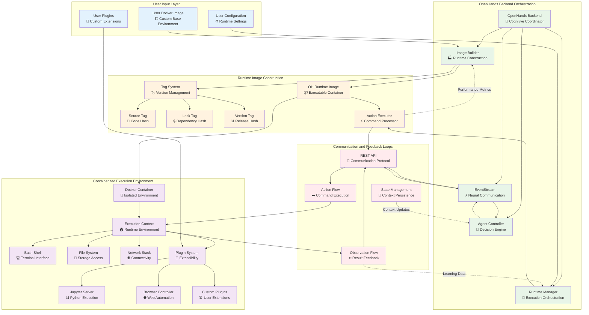
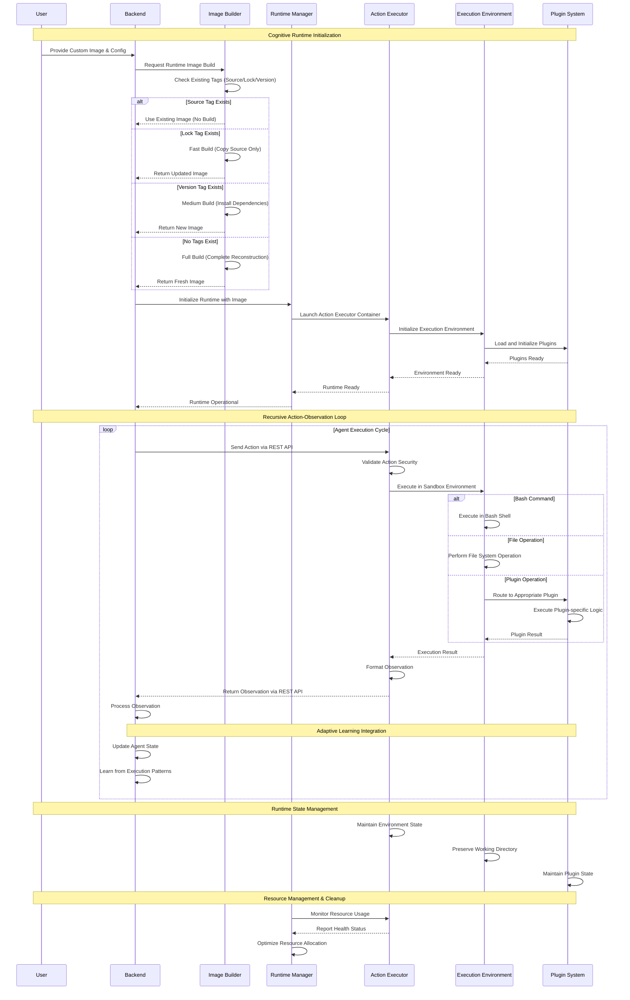
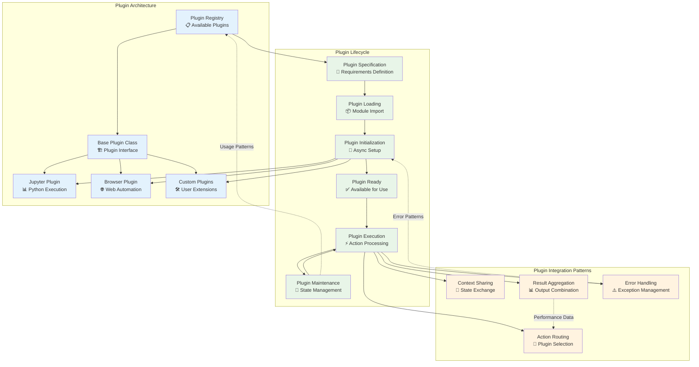

---
title: Runtime Architecture
---

# Runtime Architecture

The OpenHands Runtime system provides a comprehensive execution environment that enables secure, adaptive, and recursive execution patterns for AI agents. This document details the runtime architecture with enhanced cognitive diagrams showing emergent execution behaviors.

## Comprehensive Runtime Overview

For detailed runtime and security architecture with Mermaid diagrams, see:
- [Runtime and Security Architecture](./runtime-security-architecture.mdx) - Comprehensive security and execution diagrams
- [Event System and Memory Architecture](./event-memory-architecture.mdx) - Event-driven patterns and memory management
- [Comprehensive Architecture Overview](./comprehensive-overview.mdx) - System-wide architectural patterns

## Why Do We Need a Sandboxed Runtime?

OpenHands needs to execute arbitrary code in a secure, isolated environment for several reasons:

1. **Security**: Executing untrusted code can pose significant risks to the host system. A sandboxed environment prevents malicious code from accessing or modifying the host system's resources
2. **Consistency**: A sandboxed environment ensures that code execution is consistent across different machines and setups, eliminating "it works on my machine" issues
3. **Resource Control**: Sandboxing allows for better control over resource allocation and usage, preventing runaway processes from affecting the host system
4. **Isolation**: Different projects or users can work in isolated environments without interfering with each other or the host system
5. **Reproducibility**: Sandboxed environments make it easier to reproduce bugs and issues, as the execution environment is consistent and controllable

## Enhanced Runtime Architecture with Cognitive Patterns

The OpenHands Runtime system uses a client-server architecture with recursive feedback loops and emergent behavioral patterns:

## Runtime Cognitive Execution Flow

This diagram shows the recursive execution patterns and emergent behaviors in the runtime system:

## How the Runtime Works

The OpenHands Runtime system implements a sophisticated execution environment with the following key components:

1. **User Input Processing**: The user provides a custom base Docker image, configuration settings, and optional plugins
2. **Intelligent Image Building**: OpenHands builds a new Docker image (the "OH runtime image") using a smart tagging system that optimizes build times through incremental updates
3. **Container Orchestration**: The runtime manager launches a Docker container using the OH runtime image with proper resource allocation and security constraints
4. **Action Execution Server**: The action execution server initializes an `ActionExecutor` inside the container, setting up components like bash shell, file system access, and plugin integration
5. **Bi-directional Communication**: The OpenHands backend communicates with the action execution server over RESTful API, enabling real-time action dispatch and observation collection
6. **Recursive Execution Patterns**: The runtime client receives actions, executes them in the sandboxed environment, and sends back observations, creating feedback loops for continuous learning
7. **State Persistence**: The execution environment maintains state across actions, preserving context and enabling complex multi-step operations

### The Role of the Action Executor

The action executor serves as the cognitive interface between the OpenHands backend and the sandboxed environment:

- **Security Gateway**: It validates and sanitizes all incoming actions before execution
- **Environment Manager**: It maintains the state of the sandboxed environment, including working directory, environment variables, and loaded plugins
- **Execution Coordinator**: It routes different types of actions (shell commands, file operations, Python code, etc.) to appropriate execution contexts
- **Observation Formatter**: It processes execution results and formats them as structured observations for the backend
- **Adaptive Interface**: It learns from execution patterns to optimize future operations

## Image Building and Management System

OpenHands' approach to building and managing runtime images ensures efficiency, consistency, and flexibility through a sophisticated three-tier tagging system.

### Intelligent Image Tagging System

OpenHands uses a three-tag system for runtime images that balances reproducibility with build efficiency:

- **Source Tag**: `oh_v{version}_{lock_hash}_{source_hash}` - Most specific, includes source code hash
- **Lock Tag**: `oh_v{version}_{lock_hash}` - Dependency-specific, includes pyproject.toml and poetry.lock
- **Versioned Tag**: `oh_v{version}_{base_image}` - Most generic, base image and version only

### Adaptive Build Process

The build system implements recursive optimization patterns:

1. **No Rebuild**: Check for existing source tag (fastest)
2. **Incremental Build**: Use lock tag and copy source only (fast)
3. **Dependency Build**: Use versioned tag and install dependencies (medium)
4. **Full Build**: Complete reconstruction from base image (slowest)

This approach creates emergent build optimization where the system learns from previous builds to minimize reconstruction time.

## Runtime Plugin System Architecture

The plugin system enables extensible functionality through a recursive loading and initialization pattern:

### Key Plugin System Features

1. **Plugin Definition**: Plugins inherit from a base `Plugin` class, ensuring consistent interfaces
2. **Dynamic Registration**: Available plugins are registered in an `ALL_PLUGINS` dictionary for discovery
3. **Flexible Specification**: Users specify plugins through `Agent.sandbox_plugins: list[PluginRequirement]`
4. **Asynchronous Initialization**: Plugins initialize concurrently during runtime startup
5. **Extensible Architecture**: The system supports custom plugins for domain-specific functionality
6. **Recursive State Management**: Plugins maintain state across action executions, enabling complex workflows

---

## Technical Implementation Highlights

### Cognitive Runtime Patterns
- The runtime implements recursive execution loops where each action-observation cycle informs subsequent operations
- Emergent behaviors arise from the interaction between plugins, execution environment, and agent decision-making
- Adaptive resource management optimizes performance based on execution patterns

### Security-First Architecture
- Multi-layered security validation ensures safe execution of arbitrary code
- Container isolation provides strong security boundaries
- Plugin system maintains security contexts for external integrations

### Distributed Cognition
- Runtime components collaborate to maintain system-wide execution context
- Event-driven communication enables real-time coordination between backend and execution environment
- Adaptive learning improves runtime performance and reliability over time

## How OpenHands builds and maintains OH Runtime images

OpenHands' approach to building and managing runtime images ensures efficiency, consistency, and flexibility in creating and maintaining Docker images for both production and development environments.

Check out the [relevant code](https://github.com/All-Hands-AI/OpenHands/blob/main/openhands/runtime/utils/runtime_build.py) if you are interested in more details.

### Image Tagging System

OpenHands uses a three-tag system for its runtime images to balance reproducibility with flexibility.
Tags may be in one of 2 formats:

- **Versioned Tag**: `oh_v{openhands_version}_{base_image}` (e.g.: `oh_v0.9.9_nikolaik_s_python-nodejs_t_python3.12-nodejs22`)
- **Lock Tag**: `oh_v{openhands_version}_{16_digit_lock_hash}` (e.g.: `oh_v0.9.9_1234567890abcdef`)
- **Source Tag**: `oh_v{openhands_version}_{16_digit_lock_hash}_{16_digit_source_hash}`
  (e.g.: `oh_v0.9.9_1234567890abcdef_1234567890abcdef`)

#### Source Tag - Most Specific

This is the first 16 digits of the MD5 of the directory hash for the source directory. This gives a hash
for only the openhands source

#### Lock Tag

This hash is built from the first 16 digits of the MD5 of:

- The name of the base image upon which the image was built (e.g.: `nikolaik/python-nodejs:python3.12-nodejs22`)
- The content of the `pyproject.toml` included in the image.
- The content of the `poetry.lock` included in the image.

This effectively gives a hash for the dependencies of Openhands independent of the source code.

#### Versioned Tag - Most Generic

This tag is a concatenation of openhands version and the base image name (transformed to fit in tag standard).

#### Build Process

When generating an image...

- **No re-build**: OpenHands first checks whether an image with the same **most specific source tag** exists. If there is such an image,
  no build is performed - the existing image is used.
- **Fastest re-build**: OpenHands next checks whether an image with the **generic lock tag** exists. If there is such an image,
  OpenHands builds a new image based upon it, bypassing all installation steps (like `poetry install` and
  `apt-get`) except a final operation to copy the current source code. The new image is tagged with a
  **source** tag only.
- **Ok-ish re-build**: If neither a **source** nor **lock** tag exists, an image will be built based upon the **versioned** tag image.
  In versioned tag image, most dependencies should already been installed hence saving time.
- **Slowest re-build**: If all of the three tags don't exists, a brand new image is built based upon the base
  image (Which is a slower operation). This new image is tagged with all the **source**, **lock**, and **versioned** tags.

This tagging approach allows OpenHands to efficiently manage both development and production environments.

1. Identical source code and Dockerfile always produce the same image (via hash-based tags)
2. The system can quickly rebuild images when minor changes occur (by leveraging recent compatible images)
3. The **lock** tag (e.g., `runtime:oh_v0.9.3_1234567890abcdef`) always points to the latest build for a particular base image, dependency, and OpenHands version combination

## Runtime Plugin System

The OpenHands Runtime supports a plugin system that allows for extending functionality and customizing the runtime environment. Plugins are initialized when the runtime client starts up.

Check [an example of Jupyter plugin here](https://github.com/All-Hands-AI/OpenHands/blob/ecf4aed28b0cf7c18d4d8ff554883ba182fc6bdd/openhands/runtime/plugins/jupyter/__init__.py#L21-L55) if you want to implement your own plugin.

*More details about the Plugin system are still under construction - contributions are welcomed!*

Key aspects of the plugin system:

1. Plugin Definition: Plugins are defined as Python classes that inherit from a base `Plugin` class
2. Plugin Registration: Available plugins are registered in an `ALL_PLUGINS` dictionary
3. Plugin Specification: Plugins are associated with `Agent.sandbox_plugins: list[PluginRequirement]`. Users can specify which plugins to load when initializing the runtime
4. Initialization: Plugins are initialized asynchronously when the runtime client starts
5. Usage: The runtime client can use initialized plugins to extend its capabilities (e.g., the JupyterPlugin for running IPython cells)
